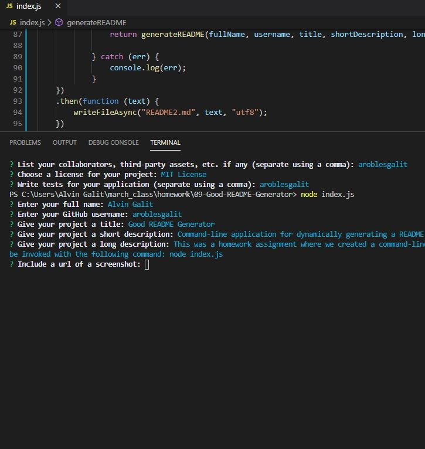

# Good README Generator    
> Command-line application that dynamically generates a README  

## Description

This was a homework assignment where we created a command-line application that prompts users and uses that response to dynamically create a README.

## Table of Contents
* [Installation](#installation)
* [Usage](#usage)
* [Credits](#credits)
* [License](#license)
* [Contributing](#contributing)
* [Tests](#tests)
* [Author](#author)

## Installation

    Step one, Step two, Step three

## Usage

    Example one, Example two, Example three

## Credits

    Credit one, Credit two, Credit three

## License

    MIT License

## Contributing

Please note that this project is released with a Contributor Code of Conduct. By participating in this project you agree to abide by its terms.

[Contributor Covenant Code of Conduct](https://www.contributor-covenant.org/version/2/0/code_of_conduct/)

## Tests

    Test one, Test two, Test three

## Author

Name: __Alvin Galit__  
GitHub: github.com/aroblesgalit  

---
© 2020 Alvin Galit. All Rights Reserved.
